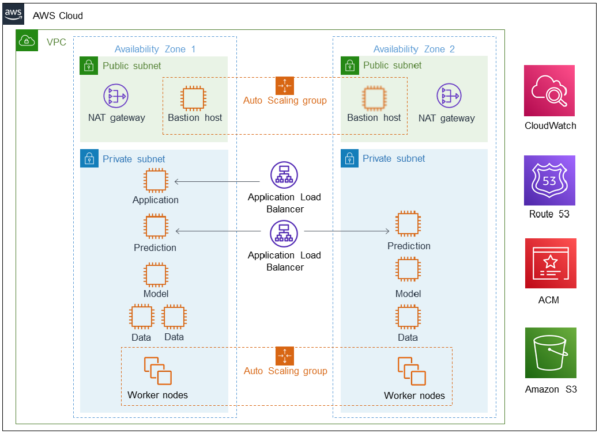

:xrefstyle: short

Deploying this Quick Start for a new virtual private cloud (VPC) with
default parameters builds the following {partner-product-short-name} environment in the
AWS Cloud.

// Replace this example diagram with your own. Follow our wiki guidelines: https://w.amazon.com/bin/view/AWS_Quick_Starts/Process_for_PSAs/#HPrepareyourarchitecturediagram. Upload your source PowerPoint file to the GitHub {deployment name}/docs/images/ directory in this repo. 

[#architecture1]
.Quick Start architecture for {partner-product-short-name} on AWS

As shown in <<architecture1>>, the Quick Start sets up the following:

* A highly available architecture that spans two Availability Zones.*
* A VPC configured with public and private subnets, according to AWS
best practices, to provide you with your own virtual network on AWS.*
* In the public subnets:
** Managed network address translation (NAT) gateways to allow outbound
internet access for resources in the private subnets.*
** A Linux bastion host in an Auto Scaling group to allow inbound Secure
Shell (SSH) access to Elastic Compute Cloud (Amazon EC2) instances in public and private subnets.*
* An Application Load Balancer as the front end for the application server.
* An Application Load Balancer as the front end for the dedicated prediction servers.
* In the private subnets:
** An EC2 instance for the application node.
** Two EC2 instances for the high availability (HA) prediction nodes used for running model predictions in real-time or batch loads.
** Two EC2 instances for the nodes used for constructing data models. 
** Three EC2 instances for the HA data (back-end) nodes running Mongo and Redis.
** An Auto Scaling group with 1-5 EC2 instances with worker nodes for machine learning.
* Amazon CloudWatch alarms for Auto Scaling based on load.
* (HTTPS option) Amazon Route 53 zone records, if applicable.
* (HTTPS option) Certificates in AWS Certificate Manager for Application Load Balancers.
* Non-public Amazon Simple Storage Service (Amazon S3) bucket for data storage and ingest operations.

// Add bullet points for any additional components that are included in the deployment. Make sure that the additional components are also represented in the architecture diagram. End each bullet with a period.

[.small]#* The template that deploys the Quick Start into an existing VPC skips the components marked by asterisks and prompts you for your existing VPC configuration.#
